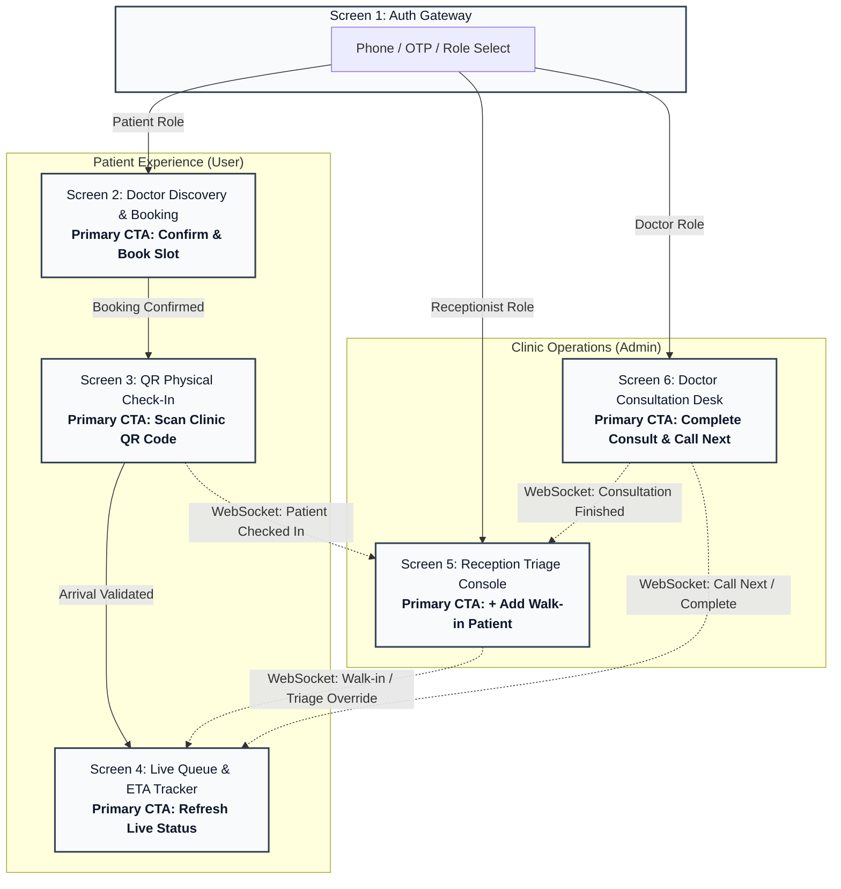

# QureFlow MVP: UI/UX Architecture & Screen Specification

**Role:** Senior Product Designer (UX)  
**System:** QureFlow Real-Time Clinic Queue Management Platform  
**MVP Scope:** 6 Core Screens across 3 Persona Tiers (`Guest`, `User / Patient`, `Admin / Staff`)

---

## 1. Executive Summary & Screen Inventory (7 Screens)

To solve physical waiting room uncertainty while eliminating operational friction for clinic staff, the system architecture comprises **7 modular screens**:

1. **Screen 1: Authentication & Role Gateway** (`Guest`)
2. **Screen 2: Patient Home Dashboard** (`User - Patient`)
3. **Screen 3: Doctor Discovery & Appointment Booking** (`User - Patient`)
4. **Screen 4: QR Physical Arrival & Check-In** (`User - Patient`)
5. **Screen 5: Patient Live Queue & ETA Tracker** (`User - Patient`)
6. **Screen 6: Reception Queue & Triage Console** (`Admin - Receptionist`)
7. **Screen 7: Doctor Consultation & Vitals Desk** (`Admin - Doctor`)

---

## 2. Core Screen Specifications

The table below details each screen's purpose, target role, essential UI components, single primary CTA, and all 4 fundamental UI states (*Loading, Empty, Error, Success*).

| Screen | Role | Key Components | Primary CTA | States |
| :--- | :--- | :--- | :--- | :--- |
| **1. Auth & Role Gateway**<br/><br/>*Purpose:* Provide frictionless, low-barrier entry via OTP for patients and credentialed sign-in for clinic staff. | **Guest** *(Patient / Staff)* | • Role Segmented Control (`Patient` \| `Staff`)<br/>• Mobile Number Input (+91) with auto-focus<br/>• 6-digit inline OTP input box (Patient flow)<br/>• Password & Clinic ID selector (Staff flow)<br/>• Resend OTP countdown timer<br/>• Security & Terms microcopy | **`Verify & Continue`** *(or `Sign In to Clinic` for Staff)* | • **Loading:** Input fields locked; CTA displays animated loading spinner with microcopy *"Verifying credentials..."*<br/>• **Empty:** Pristine inputs with placeholder `Enter 10-digit mobile number`; primary CTA is disabled (`opacity: 0.5`).<br/>• **Error:** Inline red alert banner (`"Incorrect OTP. 2 attempts left"` or `"Invalid mobile format"`); input shake animation with `#EF4444` border.<br/>• **Success:** Green checkmark pulse; seamless routing to **Patient Home** or **Staff Desks**. |
| **2. Patient Home Dashboard**<br/><br/>*Purpose:* Act as the central landing hub for logged-in patients, dynamically surfacing their active visit state, quick actions, on-duty doctors, and visit history. | **User** *(Patient)* | • Dynamic Active Context Card (Token `#A-14` or Today's Booking)<br/>• 4-Quick Action Grid (`Book Slot`, `QR Check-in`, `Live Token`, `Records`)<br/>• Available Specialists on Duty list<br/>• Recent Consultations & Vitals history<br/>• Clinic operational status badge | **`Open Live Queue`** *(or `Scan QR Check-In` / `Book Visit` based on state)* | • **Loading:** Shimmer skeleton cards for active visit card and doctors list.<br/>• **Empty:** Warm zero-state card *"No appointments scheduled today"* with primary CTA `"Book an Appointment"`.<br/>• **Error:** Offline notification banner with cached visit details.<br/>• **Success:** Real-time state-reactive dashboard displaying live token countdown or check-in readiness. |
| **3. Doctor Discovery & Slot Booking**<br/><br/>*Purpose:* Allow patients to choose a physician, visit type, and time slot to secure an appointment. | **User** *(Patient)* | • Doctor Profile Card (Name, Speciality, OPD hours, avg. consult time)<br/>• Visit Type Selector (`New Visit` vs `Follow-Up`)<br/>• Horizontal 7-day calendar date carousel<br/>• Slot Chips Grid grouped by `Morning`, `Afternoon`, `Evening`<br/>• Booking Summary Sticky Footer | **`Confirm & Book Slot`** | • **Loading:** Shimmer skeleton cards for doctor details and pulsing gray pills for time slots.<br/>• **Empty:** Zero-state illustration *"No slots available for this date"* with secondary button `"Notify for Next Available Slot"`.<br/>• **Error:** Sticky toast *"Selected slot was just booked by another patient. Slots refreshed."*; auto-highlights nearest open slot.<br/>• **Success:** Confirmation modal showing **Booking ID**, scheduled slot time, clinic location, and active transition to **QR Check-in**. |
| **3. QR Physical Check-In & Token Pass**<br/><br/>*Purpose:* Validate physical arrival at clinic premises within the check-in window (±15 mins) and generate an active queue token. | **User** *(Patient)* | • Upcoming Appointment Card (Doctor, Time, Clinic)<br/>• Camera QR Viewfinder reticle with active scanning beam<br/>• Check-in eligibility pill (`"Check-in opens 15m before slot"`)<br/>• Manual 6-Digit Clinic Code fallback link (`"Can't scan?"`)<br/>• Camera permission recovery banner | **`Scan Clinic QR Code`** *(or `Submit Code`)* | • **Loading:** Translucent camera viewport blur with active scanning radar animation and microcopy *"Validating arrival at clinic..."*<br/>• **Empty:** Zero state *"No appointments found for today"* with secondary link `"Book Appointment"` or `"Approach Reception"`.<br/>• **Error:** Bottom sheet alert: *"Check-in Denied: You are outside the 15-minute arrival window"* or *"Invalid QR Code for this clinic."*<br/>• **Success:** Haptic vibration & sound prompt; generates **Token ID** (e.g. `#A-14`) and auto-navigates to **Screen 4**. |
| **4. Live Queue & ETA Tracker**<br/><br/>*Purpose:* Deliver real-time, anxiety-reducing visibility into queue progress, dynamic wait times, and current consulting status. | **User** *(Patient)* | • Prominent Token Hero Tile (e.g., `#A-14` • `IN_QUEUE`)<br/>• Real-time Stats Grid:<br/>&nbsp;&nbsp;– *Patients Ahead: 3*<br/>&nbsp;&nbsp;– *Est. Wait: 25–35 mins (dynamic range)*<br/>&nbsp;&nbsp;– *Currently Serving: #A-11*<br/>• State Machine Stepper (`Booked` → `Checked-in` → `In Queue` → `In Consult` → `Done`)<br/>• Doctor Activity Pill (`Dr. Rao: Active` or `On 10m Break`)<br/>• Emergency Cancel / Leave Queue link | **`Refresh Live Status`** *(Background auto-updates via WebSockets)* | • **Loading:** Subtle pulsing skeletons on token number, wait-time range badge, and queue position indicator.<br/>• **Empty:** Card stating *"You do not have an active queue token"* with a prominent button `"Check In with QR Code"`.<br/>• **Error:** Top banner *"Live sync disconnected. Showing cached wait time"* with manual `"Retry Connection"` action.<br/>• **Success:** Real-time synchronized state. When called: Fullscreen chime/notification modal: *"It's Your Turn! Please proceed to Room 2"*. |
| **5. Reception Queue & Triage Console**<br/><br/>*Purpose:* Enable clinic staff to monitor arrivals, handle walk-in entries, correct queue discrepancies, and flag no-shows. | **Admin** *(Receptionist)* | • Real-Time Queue Table (Token, Patient Name, Arrival, Wait Time, Doctor, State)<br/>• Top Metrics Strip (`Waiting: 8`, `Serving: 2`, `Done: 14`, `No-Shows: 3`)<br/>• Walk-In Drawer Form (Name, Phone, Doctor, Urgency tag)<br/>• Row Action Menu (`Manual Check-in`, `Mark No-Show`, `Prioritize`, `Cancel`)<br/>• WebSocket Connection Health Indicator (`● Live`) | **`+ Add Walk-in Patient`** | • **Loading:** Shimmer table rows with animated gray blocks across queue positions and metric counters.<br/>• **Empty:** Empty table illustration *"Queue is empty. Arriving patients and walk-ins will appear here in real time."*<br/>• **Error:** Destructive banner *"Action failed: Unable to update token #A-08 status. Re-syncing queue..."* with `"Retry"` action.<br/>• **Success:** Live reactive table rows highlighting state changes with color transitions (green for arrivals, amber for triage). |
| **6. Doctor Consultation & Vitals Console**<br/><br/>*Purpose:* Keep consultation throughput steady by surfacing current patient context, running consult timers, and logging basic vitals. | **Admin** *(Doctor)* | • Active Patient Card (Token `#A-12`, Name, Age/Gender, Visit Type: `New`/`Follow-up`)<br/>• Live Elapsed Consult Timer (`11:42 min`)<br/>• Quick Vitals Entry Form (`Blood Pressure`, `Sugar`, `Weight`)<br/>• Up-Next Queue Preview Drawer (Next 3 queued tokens)<br/>• Doctor Status Switcher (`Available` \| `On 10m Break`) | **`Complete Consult & Call Next`** | • **Loading:** Button state with circular spinner *"Saving vitals & advancing queue..."*; form disabled.<br/>• **Empty:** Standby card: *"Queue is clear! No patients currently waiting"* with status toggle set to `"Ready for Patients"`.<br/>• **Error:** Sticky top alert *"Network timeout: Vitals cached locally. Click to retry sync before calling next patient."*<br/>• **Success:** Timer resets to `00:00`, vitals form clears, and the next patient record animates into the active pane. |

---

## 3. End-to-End Navigation & State Flow

### Flow 1: Patient Primary Journey
```
[Screen 1: Auth & Role Gateway]
       │
       ▼ (Successful OTP verification)
[Screen 2: Doctor Discovery & Slot Booking]
       │
       ▼ (Slot selected & confirmed -> Appointment created)
[Screen 3: QR Physical Check-In & Token Pass]
       │
       ▼ (Physical QR scanned at clinic entrance within ±15 min window)
[Screen 4: Live Queue & ETA Tracker]
       │
       ▼ (Doctor calls token -> Patient enters consultation -> Consultation completed)
[Screen 4: Live Queue Tracker (State: DONE / Visit Summary)]
```

### Flow 2: Receptionist Operational Flow
```
[Screen 1: Auth & Role Gateway (Staff Tab)]
       │
       ▼ (Staff authentication)
[Screen 5: Reception Queue & Triage Console]
       ├─► (Clicks "+ Add Walk-in") ──► [Walk-In Modal/Drawer] ──► (Returns to Screen 5 with generated Token)
       ├─► (Patient unable to scan QR) ──► [Manual Check-In Action] ──► (Updates Screen 5 & triggers Screen 4 for Patient)
       └─► (Patient absent after calls) ──► [Mark NO_SHOW] ──► (Removes from Live Queue, recalculates ETA for all patients)
```

### Flow 3: Doctor Clinical Flow
```
[Screen 1: Auth & Role Gateway (Staff Tab)]
       │
       ▼ (Staff authentication)
[Screen 6: Doctor Consultation & Vitals Console]
       ├─► (Doctor clicks "Start Consult") ──► [Timer starts; Patient status moves to CHECK_UP]
       ├─► (Doctor inputs BP, Sugar, Weight) ──► [Vitals recorded]
       └─► (Doctor clicks "Complete Consult & Call Next") ──► [Patient moves to DONE, Next patient auto-called, Screen 4 & 5 update instantly]
```

---

## 4. Multi-Role Navigation Architecture Diagram



---

## 5. Senior UX Decisions & Design Heuristics

1. **Decoupling Booking from Queue Entry (Anti-Ghost Queue Pattern):**
   * *Problem:* Patients book appointments days in advance, but traffic delays or cancellations distort traditional queues.
   * *UX Solution:* Booking on **Screen 2** does *not* assign a live queue position. Only physical scanning on **Screen 3** promotes the patient to `IN_QUEUE`. This keeps the queue on **Screens 4, 5, and 6** 100% physically authentic.
2. **ETA Representation as an Elastic Range (Anxiety Reduction):**
   * On **Screen 4**, the wait time is presented as a range (`25–35 mins`), calculated using a rolling average of the doctor's last 5 consultations plus the active consultation timer. This manages expectations far better than a static timestamp that risks missing reality.
3. **Single Primary Action Discipline:**
   * Every screen strictly features **one visually dominant CTA** with high visual hierarchy (`#2563EB` primary fill), ensuring patients experiencing anxiety or doctors operating under tight consult windows never hesitate on the next step.
