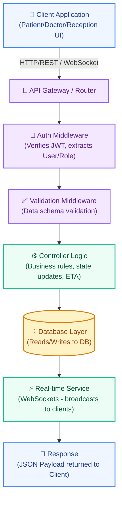

# QureFlow: Features, APIs, and Architecture Blueprint

Based on the MVP scope, this document defines the database schema, API contracts, controller logic, and the complete request/response flow for the core functionalities of the QureFlow queue management system.

## 1. List of Features with their Importance (MVP Scope)

### Module A: User Auth & Profiles
| Feature | Importance | Description |
|---|---|---|
| Patient Registration / Login | MUST-HAVE | Core entry point for patients to use the system. |
| Doctor / Reception Login | MUST-HAVE | Core entry point for clinic staff. |

### Module B: Booking & Queue Management
| Feature | Importance | Description |
|---|---|---|
| View Available Doctors | MUST-HAVE | Required to select a doctor before booking. |
| Book Appointment | MUST-HAVE | Core transaction for the application. |
| Get Live Queue Status (Patient) | MUST-HAVE | Real-time queue position and ETA tracking. |

### Module C: Clinic Operations (Reception)
| Feature | Importance | Description |
|---|---|---|
| QR Check-in | MUST-HAVE | Transitions a booked appointment into the live physical queue. |
| Add Walk-in | SHOULD-HAVE | Exception handling for patients arriving without prior booking. |
| Mark No-Show | SHOULD-HAVE | Exception handling for missing patients. |
| Queue Correction | SHOULD-HAVE | Manual overrides by reception to fix queue inconsistencies. |

### Module D: Doctor Workflow
| Feature | Importance | Description |
|---|---|---|
| Start Consultation | MUST-HAVE | Moves patient from IN_QUEUE to CHECK_UP. Starts timer. |
| Complete Consultation & Add Vitals | MUST-HAVE | Moves patient to DONE. Ends timer. Records basic vitals. |
| Doctor State Management | MUST-HAVE | Update doctor availability (e.g. ON_BREAK). |

---

## 2. General Architecture Flow & Request Lifecycle

The following diagram illustrates the complete request/response lifecycle for any client request, from the UI down to the database and real-time syncing:



---

## 3. APIs List

| Module | Endpoint | Method | Request Body | Response Body | Controller Logic | Complete Flow |
|---|---|---|---|---|---|---|
| **Auth** | `/api/v1/auth/login` | `POST` | `{ phone, password }` | `{ token, user: { id, role } }` | Find user -> Verify password -> Generate JWT. | `Client -> Validation -> AuthController -> DB -> Res` |
| **Booking** | `/api/v1/appointments` | `POST` | `{ doctorId, date, time, type }` | `{ appointmentId, status }` | Validate doctor -> Check slot -> Create record. | `Client -> Auth -> Validation -> ApptController -> DB -> Res` |
| **Check-in** | `/api/v1/visits/check-in` | `POST` | `{ clinicId, appointmentId }` | `{ visitId, tokenId, status, ETA }` | Validate time window -> Generate token -> Fire WS event. | `Client -> Auth -> CheckInValidator -> VisitController -> DB/WS -> Res` |
| **Queue** | `/api/v1/visits/my-status` | `GET` | *None* | `{ tokenId, position, patientsAhead, ETA, doctorStatus }` | Count earlier `IN_QUEUE` visits -> Calculate ETA. | `Client -> Auth -> QueueController -> DB -> Res` |
| **Doctor** | `/api/v1/visits/:id/start` | `PUT` | *None* | `{ success: true, status: "CHECK_UP" }` | Ensure no active `CHECK_UP` -> Update status -> Fire WS. | `Client -> Auth -> VisitController -> DB/WS -> Res` |
| **Doctor** | `/api/v1/visits/:id/complete`| `PUT` | `{ vitals: { bp, sugar, weight } }` | `{ success: true, status: "DONE" }` | Update status to `DONE` -> Save vitals -> Fire WS. | `Client -> Auth -> VisitController -> DB/WS -> Res` |
| **Reception**| `/api/v1/visits/:id/status` | `PUT` | `{ status: "NO_SHOW" }` | `{ success: true }` | Update visit status -> Trigger WS recalculation. | `Client -> Auth -> QueueController -> DB/WS -> Res` |

---

## 4. Database Schema (NoSQL / MongoDB approach)

### Users Collection
Stores all users including Patients, Doctors, and Receptionists.
```json
{
  "_id": "ObjectId",
  "role": "enum('PATIENT', 'DOCTOR', 'RECEPTIONIST')",
  "name": "String",
  "phone": "String (Unique)",
  "email": "String",
  "passwordHash": "String",
  "clinicId": "ObjectId (for Doctors & Receptionists)",
  "specialization": "String (for Doctors)"
}
```

### Appointments Collection
Stores scheduled appointments.
```json
{
  "_id": "ObjectId",
  "patientId": "ObjectId (Ref: Users)",
  "doctorId": "ObjectId (Ref: Users)",
  "clinicId": "ObjectId (Ref: Clinics)",
  "appointmentDate": "Date (YYYY-MM-DD)",
  "appointmentTime": "String (HH:mm)",
  "type": "enum('NEW', 'FOLLOW-UP')",
  "status": "enum('BOOKED', 'CANCELLED')"
}
```

### Visits (Queue & Tokens) Collection
Stores the actual visits and live queue states.
```json
{
  "_id": "ObjectId",
  "appointmentId": "ObjectId (Ref: Appointments, nullable for walk-ins)",
  "patientId": "ObjectId (Ref: Users)",
  "doctorId": "ObjectId (Ref: Users)",
  "clinicId": "ObjectId (Ref: Clinics)",
  "visitDate": "Date (YYYY-MM-DD)",
  "tokenId": "String (e.g., A-17)",
  "status": "enum('CHECKED_IN', 'IN_QUEUE', 'CHECK_UP', 'DONE', 'NO_SHOW', 'CANCELLED')",
  "isUrgent": "Boolean",
  "checkedInAt": "Timestamp",
  "consultStartedAt": "Timestamp",
  "consultEndedAt": "Timestamp",
  "vitals": {
    "bp": "String",
    "sugar": "Number",
    "weight": "Number"
  }
}
```

### Clinics Collection
```json
{
  "_id": "ObjectId",
  "name": "String",
  "address": "String",
  "checkInWindowStartMinutes": "Number (e.g., 15)",
  "checkInWindowEndMinutes": "Number (e.g., 15)"
}
```
