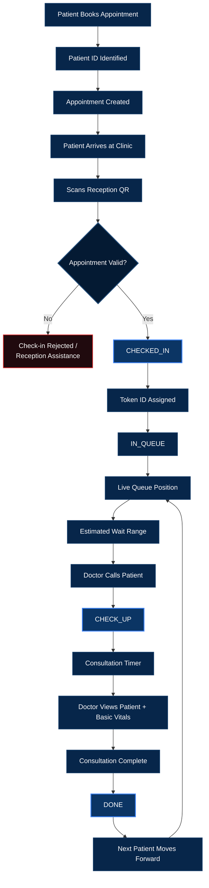
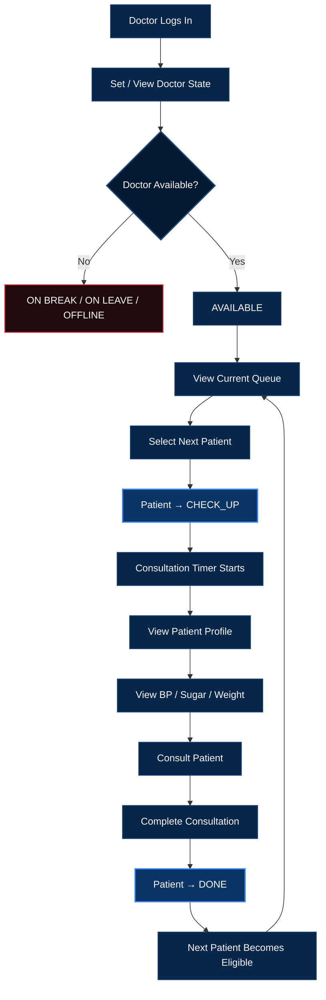
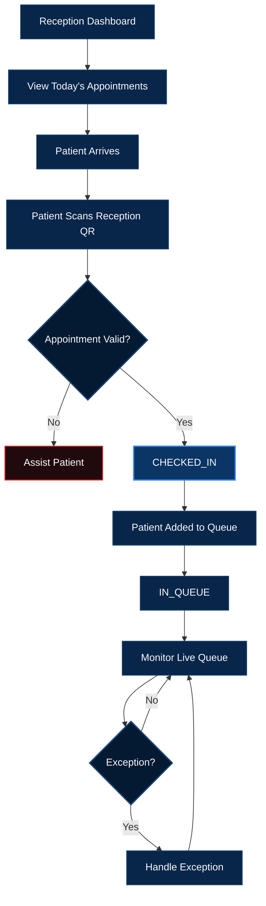
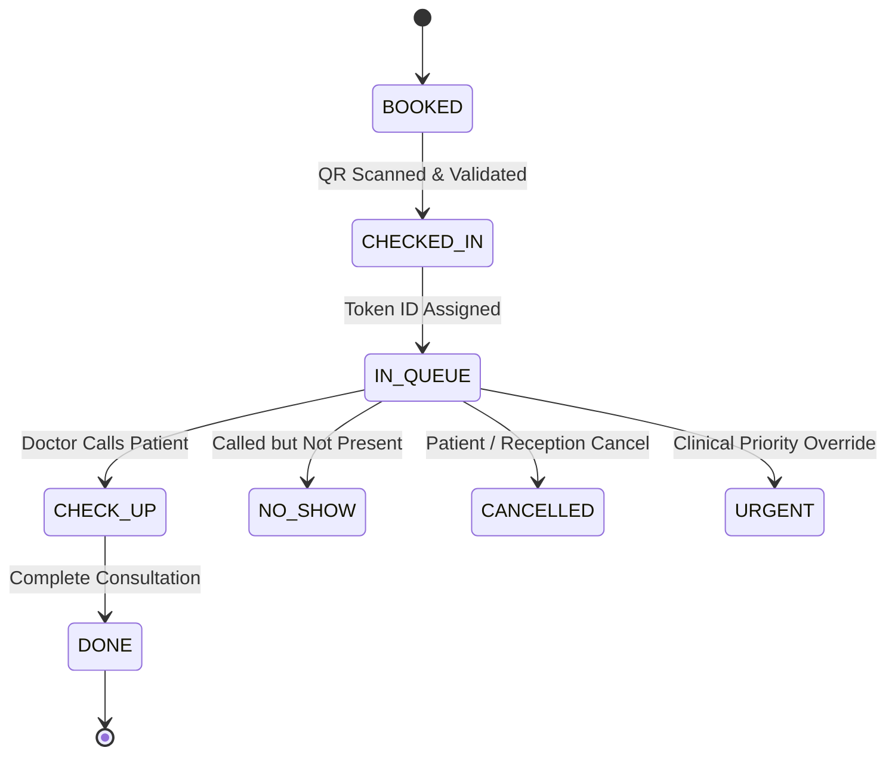

# The MVP Value Proposition

For small clinics and OPDs struggling with unpredictable waiting times and manually managed queues, **QureFlow** is a lightweight, real-time clinic queue management platform that connects patients, reception staff, and doctors through one synchronized workflow.

The platform starts with appointment booking and continues beyond the booking stage. When a patient reaches the clinic, they check in through a reception QR code, receive a visit-specific Token ID, enter the live queue, and continuously see their queue position and estimated waiting-time range.

At the same time, receptionists can manage check-ins and queue exceptions, while doctors can manage the current consultation, view essential patient information, record basic vitals, and complete consultations.

The core promise is:

> **Book → Check-in → Get Token → Track Queue → Know Your Turn → Consult → Done**

----

# MVP Scope & MoSCoW Prioritization

The MVP is designed to be buildable as a working prototype in **4 days**.

The priority is not to build a complete hospital-management system. The priority is to validate one core problem:

> **Can a clinic maintain an accurate live queue while patients get useful, real-time information about their position and expected waiting time?**

The scope is divided into:

* 🔴 **Must-Have:** Required for the core product to work.
* 🟡 **Should-Have:** Important supporting features that can be implemented after the core workflow is stable.
* 🟢 **Could-Have:** Useful future improvements that should not threaten the 4-day MVP.
* ⚫ **Won't-Have:** Explicitly excluded from the MVP.

----

# 🔴 MUST-HAVE — Core Features

## 1. Patient ID

Every patient has a permanent, unique **Patient ID**.

The Patient ID answers:

> **"Who is this patient?"**

It remains associated with the patient across appointments and clinic visits.

Example:

```text
Patient Name: Junaid Khan
Patient ID: P-1024
```

The Patient ID is different from the Token ID.

### Patient ID vs Token ID

| Identifier | Purpose | Lifetime |
|---|---|---|
| Patient ID | Identifies the patient | Permanent |
| Token ID | Identifies the patient's queue position for a visit | Visit-specific |

Example:

```text
Patient ID: P-1024

Visit 1 → Token A-12
Visit 2 → Token A-21
Visit 3 → Token B-07
```

This separation is important because the same patient can visit the clinic multiple times while receiving a different queue token for each visit.

---

## 2. Appointment Booking

The patient can book an appointment for a particular doctor.

The appointment contains:

* Patient ID
* Doctor
* Clinic
* Date
* Appointment time
* Consultation type
* Appointment status

Consultation type can be:

```text
NEW CONSULTATION
FOLLOW-UP
```

For the MVP, **new consultation and follow-up have the same queue priority**.

The system does not assume that a follow-up automatically gets ahead of a new patient.

### Example

```text
Patient:
Junaid Khan

Doctor:
Dr. Sharma

Date:
23 September

Appointment:
10:00 AM

Type:
New Consultation
```

---

## 3. Appointment Validation

The patient does not enter the queue simply because an appointment exists.

When the patient reaches the clinic and scans the reception QR code, the system validates the appointment.

The system checks:

```text
Patient ID
      ↓
Today's appointments
      ↓
Correct clinic
      ↓
Correct doctor/appointment
      ↓
Valid appointment time
      ↓
Check-in allowed
```

### Scenario A — Valid appointment

```text
Appointment:
Today, 10:00 AM

Current time:
9:52 AM

Status:
VALID
```

Result:

> ✅ Appointment verified. Check-in successful.

### Scenario B — Tomorrow's appointment

```text
Appointment:
Tomorrow, 10:00 AM
```

Result:

> ❌ This appointment is not available for check-in today.

### Scenario C — Expired check-in window

```text
Appointment:
10:00 AM

Valid check-in window:
9:45 AM – 10:15 AM

Current time:
10:42 AM
```

Result:

> ⚠️ Your check-in window has expired. Please contact reception.

The clinic can define the valid check-in window according to its workflow.

---

## 4. Reception QR Check-in

A QR code is placed at the **clinic reception**.

The patient scans the QR only after arriving at the clinic.

The QR code itself does not need to contain the patient's appointment information.

Instead, scanning starts the verification flow:

```text
Patient scans Reception QR
          ↓
Patient identified
          ↓
Today's appointment(s) retrieved
          ↓
Appointment validated
          ↓
Patient checked in
```

### Successful flow

```text
BOOKED
   ↓
CHECKED_IN
   ↓
IN_QUEUE
```

The patient receives a confirmation screen containing:

```text
✓ Check-in Successful

Doctor:
Dr. Sharma

Token:
A-17

Queue Position:
#4

Estimated Wait:
25–40 min
```

### Multiple appointments

If a patient has more than one appointment at the same clinic on the same day, the system should show the relevant appointments.

Example:

```text
Today's Appointments

1. Dr. Sharma
   10:00 AM

2. Dr. Verma
   11:30 AM
```

The patient can select the appointment they are checking in for.

---

## 5. Token ID Generation

After successful check-in, the system assigns a **Token ID** for that visit.

Example:

```text
Patient ID: P-1024

Today's Token:
A-17
```

The Token ID represents the patient's place in the clinic workflow.

Important distinction:

```text
Patient ID
= Permanent identity

Appointment
= Scheduled visit

Token ID
= Current visit's queue identity
```

The token should not be confused with the patient's permanent identity.

---

## 6. Patient State Management

The patient lifecycle is represented using clear states.

### Normal lifecycle

```text
BOOKED
   ↓
CHECKED_IN
   ↓
IN_QUEUE
   ↓
CHECK_UP
   ↓
DONE
```

### Exception states

```text
IN_QUEUE → NO_SHOW
IN_QUEUE → CANCELLED
IN_QUEUE → URGENT
```

### State meaning

#### BOOKED

The patient has successfully created an appointment but has not yet checked in at the clinic.

#### CHECKED_IN

The patient has arrived and successfully completed the clinic's check-in process.

#### IN_QUEUE

The patient is physically present and waiting for the doctor.

#### CHECK_UP

The doctor is currently consulting the patient.

#### DONE

The consultation has been completed.

#### NO_SHOW

The patient was expected but was not present when their turn was called.

#### CANCELLED

The appointment/visit has been cancelled.

#### URGENT

An exceptional medical situation has been identified by clinic/medical staff and requires separate handling.

> The system does not independently decide whether a patient is medically urgent. The urgent state is a clinic/medical-staff action.

---

## 7. State Ownership

The MVP should clearly define who is responsible for changing each state.

| State / Action | Primary Owner |
|---|---|
| Appointment created | System / Patient |
| BOOKED | System |
| CHECKED_IN | Reception / Validated QR flow |
| IN_QUEUE | System after successful check-in |
| CHECK_UP | Doctor |
| DONE | Doctor |
| NO_SHOW | Reception |
| CANCELLED | Patient / Reception |
| URGENT | Authorized clinic/medical staff |

The principle is:

> **Patients should not manually control clinical workflow states.**

Patients can request actions such as booking or cancellation, but the actual clinic state should be controlled by the clinic workflow.

---

## 8. Doctor State

The doctor has an independent operational state.

```text
AVAILABLE
IN_CONSULTATION
ON_BREAK
ON_LEAVE
OFFLINE
```

### AVAILABLE

Doctor is available to see patients.

### IN_CONSULTATION

Doctor is currently consulting a patient.

### ON_BREAK

Doctor is temporarily unavailable but expected to return.

### ON_LEAVE

Doctor is unavailable for the relevant clinic session/day.

### OFFLINE

Doctor is not currently active in the system.

Doctor state affects the information shown to patients.

Example:

```text
Doctor:
IN_CONSULTATION

Patient:
#4 in queue

Estimated wait:
25–40 min
```

If the doctor is on break:

> 🟡 Doctor is currently on a break. Queue will resume when consultation resumes.

If the doctor is unavailable:

> 🔴 Doctor is currently unavailable.

---

## 9. Live Queue Formation

The queue should be formed from patients who have actually checked in.

A future appointment should not automatically become part of the live physical queue.

Example:

```text
Today's bookings:

A → 9:00 AM
B → 9:15 AM
C → 9:30 AM
D → 9:45 AM
```

Actual arrivals:

```text
A → Checked in
C → Checked in
B → Not arrived
D → Not arrived
```

The live queue becomes:

```text
A
C
```

not:

```text
A
B
C
D
```

This separates **scheduled appointment order** from **actual clinic presence**.

---

## 10. Queue Position

Queue position is derived from the current state of patients.

Example:

```text
A-14 → DONE
A-15 → CHECK_UP
A-16 → IN_QUEUE
A-17 → IN_QUEUE
A-18 → IN_QUEUE
```

The system understands:

```text
Currently Consulting:
A-15

Waiting:
A-16
A-17
A-18
```

Patient A-17 sees:

```text
Your Token:
A-17

Current Position:
#2

Patients Ahead:
1

Currently Consulting:
A-15
```

The patient does not need to manually update their position.

---

## 11. Doctor Dashboard

The doctor dashboard is the main control surface for the consultation workflow.

The doctor can see:

* Current patient
* Current Token ID
* Patient name
* Next patients
* Consultation type
* Patient profile
* Basic vitals
* Consultation timer
* Start/complete consultation controls

Example:

```text
---------------------------------------
DR. SHARMA

Status:
🟢 IN CONSULTATION

CURRENT PATIENT
Token: A-17
Name: Junaid Khan

Type:
New Consultation

Vitals
BP:     120/80
Sugar:  96 mg/dL
Weight: 68 kg

Consultation Time
08:42

[ Complete Consultation ]

---------------------------------------

NEXT PATIENT
A-18 — Priya Singh

FOLLOWING
A-19 — Rahul Kumar
---------------------------------------
```

---

## 12. Basic Patient Health Profile

The MVP includes only essential patient information.

Basic vitals:

* Blood Pressure
* Blood Sugar
* Weight

Example:

```text
Patient:
Junaid Khan

Patient ID:
P-1024

Vitals:

BP:
120/80

Sugar:
96 mg/dL

Weight:
68 kg
```

The purpose is to provide the doctor with basic context without turning the MVP into a complete Electronic Medical Record system.

Detailed medical records, prescriptions, reports, and historical health analytics remain outside the core MVP.

---

## 13. Start Consultation

When the doctor is ready for the next patient, the next eligible patient moves into consultation.

Example:

```text
A-16 → IN_QUEUE
```

Doctor selects:

> **Start Consultation**

The state changes:

```text
A-16 → CHECK_UP
```

At the same time:

* Patient's screen updates.
* Patient receives "You're next" / "It's your turn" information.
* Consultation timer starts.
* Doctor dashboard displays the patient.

Patient sees:

```text
🔔 YOUR TURN

Token:
A-16

Please proceed to:
Room 1
```

---

## 14. Consultation Timer

When the patient enters `CHECK_UP`, a timer begins.

Example:

```text
CONSULTATION TIME

00:08:42
```

When the doctor completes the consultation, the timer stops.

Example:

```text
Consultation Duration:
09 min 18 sec
```

This historical consultation data is then used to estimate future waiting time.

---

## 15. Complete Consultation

When the doctor finishes:

> **Complete Consultation**

The patient moves:

```text
CHECK_UP → DONE
```

The current consultation is removed from the active queue.

The next patient becomes eligible.

Example:

```text
Before:

A-15 → CHECK_UP
A-16 → IN_QUEUE
A-17 → IN_QUEUE


After A-15 completes:

A-15 → DONE
A-16 → CHECK_UP
A-17 → IN_QUEUE
```

Patient A-17 automatically moves from:

```text
#2
```

to:

```text
#1
```

---

## 16. Real-Time Queue Updates

The core differentiator of the MVP is real-time synchronization.

When the doctor changes the current patient's state:

```text
Doctor Action
      ↓
Patient State Changes
      ↓
Queue Recalculated
      ↓
Patient Screen Updated
      ↓
Doctor Screen Updated
      ↓
Reception Screen Updated
```

Example:

```text
A-15 → DONE
A-16 → CHECK_UP
A-17 → IN_QUEUE
```

Patient A-17 immediately sees:

> **You are #1 in queue.**

When A-16 completes:

```text
A-16 → DONE
A-17 → CHECK_UP
```

Patient A-17 sees:

> 🔔 **You're next. Please proceed to the consultation room.**

No manual refresh should be required.

---

## 17. Estimated Waiting Time

The MVP should show a **time range**, not an exact prediction.

Example:

> **Estimated wait: 25–40 minutes**

The estimate is based on:

* Number of patients ahead.
* Current consultation.
* Recent consultation duration.
* Doctor availability.

### Example

Suppose:

```text
Patients ahead:
3

Average consultation:
10 min
```

A basic estimate may start around:

```text
3 × 10 = 30 minutes
```

The UI should present a range:

> **25–40 min**

rather than:

> "Your turn will be exactly at 11:30."

---

## 18. Dynamic ETA Updates

The estimated waiting time should change as the real queue changes.

Example:

```text
Initial:

Patients ahead: 3
Estimated wait: 25–40 min
```

After one consultation finishes:

```text
Patients ahead: 2
Estimated wait: 15–30 min
```

After another consultation:

```text
Patients ahead: 1
Estimated wait: 8–15 min
```

When the patient becomes next:

```text
You're next.
Please be ready for your consultation.
```

The system should clearly communicate that the ETA is an estimate.

---

## 19. Reception Dashboard

The receptionist manages the physical clinic flow.

The reception dashboard should show:

* Today's appointments.
* Checked-in patients.
* Current queue.
* Current consultation.
* Token IDs.
* Patient states.
* Doctor state.
* Manual exception controls.

Example:

```text
---------------------------------------
TODAY'S QUEUE

A-15   DONE
A-16   CHECK_UP
A-17   IN_QUEUE
A-18   IN_QUEUE
A-19   IN_QUEUE

---------------------------------------

CURRENT PATIENT
A-16 — Priya Singh

DOCTOR
🟢 IN CONSULTATION

---------------------------------------

[ Add Walk-in ]
[ Handle No-show ]
[ Queue Correction ]
---------------------------------------
```

---

## 20. Walk-in / Exception Handling

The main flow is appointment-based, but real clinics may have exceptions.

Reception should have limited controls for:

* Walk-in patients.
* Technical QR failure.
* Late patients.
* No-show patients.
* Queue corrections.
* Exceptional/urgent cases.

The purpose is not to build a complex hospital emergency system.

The purpose is simply to ensure the digital queue can be corrected when the physical clinic workflow requires it.

----

# 🟡 SHOULD-HAVE — Important Supporting Features

These should be implemented if the Must-Have workflow is stable.

## 1. Appointment History

Patient can see:

```text
Previous Appointments
Doctor
Date
Appointment Type
Status
```

## 2. Consultation Type

Show:

```text
NEW CONSULTATION
FOLLOW-UP
```

Both remain at the same queue priority.

## 3. No-show Handling

If the patient's token is called and the patient is not present:

```text
IN_QUEUE
    ↓
NO_SHOW
```

Reception can then decide how to handle the patient.

## 4. Queue Correction

Reception can correct exceptional cases without breaking the entire queue.

Possible actions:

* Add walk-in.
* Remove patient.
* Mark no-show.
* Correct check-in.
* Handle late arrival.

## 5. Basic Notifications

Patients can receive:

> You are #3 in queue.

> You are #2 in queue.

> You're next.

> Please proceed to the consultation room.

## 6. Multiple Doctors

The clinic can have multiple doctors.

The patient can have multiple appointments at the same clinic.

The system maps each appointment to the correct doctor and queue.

----

# 🟢 COULD-HAVE — Future Scope

These features can improve the product after the MVP has validated the core queue problem.

## 1. Advanced ETA Prediction

Instead of using a simple average, future versions can consider:

* Doctor-specific consultation patterns.
* Time of day.
* Historical consultation duration.
* Consultation type.
* Current consultation duration.
* Clinic-specific waiting patterns.

## 2. Detailed Medical History

Future versions can include:

* Previous diagnoses.
* Previous prescriptions.
* Medical reports.
* Historical vitals.
* Uploaded documents.
* Visit summaries.

## 3. Vitals History

Instead of showing only the latest:

```text
BP
Sugar
Weight
```

the system could provide historical charts.

## 4. Clinic Analytics

Clinic administrators could see:

* Average waiting time.
* Average consultation time.
* Patients served per day.
* Peak hours.
* No-show rate.
* Average queue size.

## 5. Advanced Notifications

Future notification channels:

* Push notifications.
* SMS.
* WhatsApp.
* Automated appointment reminders.

## 6. Patient Self-Service

Future versions could allow:

* Rescheduling.
* Digital cancellation.
* Queue re-entry.
* Appointment reminders.

----

# ⚫ WON'T-HAVE — Explicitly Out of the 4-Day MVP

To protect the 4-day development timeline, these features are intentionally excluded.

## Healthcare Infrastructure

* Full Electronic Medical Record system.
* Hospital Information System.
* Multi-hospital ecosystem.
* Insurance management.
* Insurance claims.

## Medical Features

* AI diagnosis.
* AI treatment recommendations.
* Medical decision-making.
* Advanced emergency management.
* Detailed prescription management.

## Financial Features

* Online payments.
* Billing.
* Invoice management.
* Insurance payment processing.

## Communication Features

* Video consultation.
* Telemedicine.
* Complex doctor-patient chat.

## Advanced Intelligence

* Advanced predictive queue algorithms.
* AI-based waiting-time prediction.
* Automated medical recommendations.

The MVP should remain focused on:

> **Appointment → Check-in → Token → Queue → Consultation → Completion**

----

# 🚀 Complete User Flow

## 👤 Patient Flow



---

## 👨‍⚕️ Doctor Flow



---

## 🧑‍💼 Reception Flow



---

## 🔄 Core State Flow



The complete patient state machine:

```text
                         ┌──────────────┐
                         │    BOOKED    │
                         └──────┬───────┘
                                │
                         QR + Valid Check-in
                                │
                                ▼
                       ┌────────────────┐
                       │  CHECKED_IN    │
                       └───────┬────────┘
                               │
                               ▼
                       ┌────────────────┐
                       │    IN_QUEUE    │
                       └───────┬────────┘
                               │
                         Doctor Calls
                               │
                               ▼
                       ┌────────────────┐
                       │    CHECK_UP    │
                       └───────┬────────┘
                               │
                      Consultation Complete
                               │
                               ▼
                       ┌────────────────┐
                       │      DONE      │
                       └────────────────┘
```

Exception paths:

```text
IN_QUEUE → NO_SHOW
IN_QUEUE → CANCELLED
IN_QUEUE → URGENT
```

----

# 🧠 How the Queue Actually Works

The queue should not be treated as a static list manually maintained by reception.

Instead:

```text
Patient States
      +
Doctor State
      +
Check-in Order
      +
Consultation Duration
      ↓
LIVE QUEUE
      ↓
Queue Position
      +
Patients Ahead
      +
Estimated Wait
```

Example:

```text
A-11 → DONE
A-12 → DONE
A-13 → CHECK_UP
A-14 → IN_QUEUE
A-15 → IN_QUEUE
A-16 → IN_QUEUE
```

System output:

```text
Current Patient:
A-13

A-14:
#1

A-15:
#2

A-16:
#3
```

If A-13 finishes:

```text
A-13 → DONE
A-14 → CHECK_UP
A-15 → IN_QUEUE
A-16 → IN_QUEUE
```

The system automatically updates:

```text
A-15 → #1
A-16 → #2
```

This is the core mechanism behind the real-time queue.

----

# 🔥 The Core Product Innovation

## 1. Live Queue Instead of Static Appointment

Traditional appointment flow:

```text
Book at 10:00 AM
       ↓
Arrive
       ↓
Wait
       ↓
Ask reception
       ↓
Wait again
```

QureFlow:

```text
Book
 ↓
Check-in
 ↓
Get Token
 ↓
See Queue Position
 ↓
See Estimated Wait
 ↓
Get "You're Next"
 ↓
Consult
```

The patient no longer needs to remain uncertain about their position.

---

## 2. State-Driven Clinic Workflow

Instead of manually maintaining a separate queue list, the clinic workflow is represented by states:

```text
BOOKED
CHECKED_IN
IN_QUEUE
CHECK_UP
DONE
```

Doctor availability is represented separately:

```text
AVAILABLE
IN_CONSULTATION
ON_BREAK
ON_LEAVE
OFFLINE
```

The combination of these states gives the system the information required to understand the current clinic situation.

---

## 3. Real-Time Patient Transparency

The system continuously communicates:

```text
Current Patient
Patients Ahead
Current Position
Doctor State
Estimated Waiting Range
```

Example:

```text
Dr. Sharma

Currently consulting:
A-13

Your token:
A-17

Patients ahead:
3

Your position:
#4

Estimated wait:
25–40 min
```

When the queue changes, this information changes automatically.

----

# 👥 MVP Roles

The MVP has three primary roles.

| Role | Main Responsibility |
|---|---|
| 👤 Patient | Book appointment, check in, view queue, receive turn notification |
| 🧑‍💼 Receptionist | Verify/check-in patients, manage queue, handle exceptions |
| 👨‍⚕️ Doctor | Manage consultation, view patient information, start/complete consultation |

The system should keep each role focused on its actual responsibility.

### Patient

> "Where am I in the queue?"

### Receptionist

> "Who has arrived and who is waiting?"

### Doctor

> "Who am I seeing and who is next?"

----

# 🎯 MVP Success Metrics

The primary validation question is:

> **Can a patient reliably understand where they are in the clinic queue and approximately how long they may have to wait?**

### Primary Metrics

1. **Queue Position Accuracy**
   * Does the patient's displayed position match the clinic's actual queue?

2. **State Accuracy**
   * Does the system correctly represent whether the patient is booked, checked-in, waiting, consulting, or done?

3. **ETA Usefulness**
   * Is the estimated range reasonably close to the actual waiting time?

4. **Real-Time Update Reliability**
   * Does a doctor/reception action update the patient view immediately?

### Secondary Metrics

* QR check-in completion time.
* Number of manual queue corrections.
* Average consultation duration.
* Number of no-shows.
* Number of failed check-ins.
* Number of patients who successfully receive a "You're next" notification.

----

# What We Are Actively Ignoring

To hit the 4-day deadline, we are deliberately avoiding the temptation to turn QureFlow into a complete healthcare ecosystem.

We are **not** trying to solve:

> Diagnosis  
> Payments  
> Insurance  
> Hospital management  
> Telemedicine  
> Complete medical records

We are solving one focused operational problem:

> **Patients should not have to sit in a clinic without knowing where they are in the queue or approximately how long they will wait.**

The complete MVP loop is:

```text
BOOK
 ↓
VALIDATE
 ↓
CHECK-IN
 ↓
TOKEN
 ↓
IN QUEUE
 ↓
LIVE POSITION
 ↓
ESTIMATED WAIT
 ↓
YOUR TURN
 ↓
CHECK-UP
 ↓
CONSULTATION TIMER
 ↓
DONE
 ↓
NEXT PATIENT
```

**MediQ is therefore not primarily an appointment-booking product.**

It is a **real-time clinic queue management system built around the patient's actual journey from appointment to consultation.**
