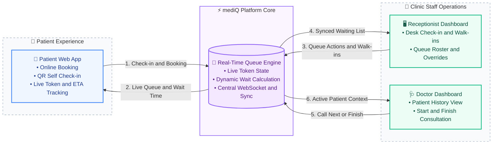

# Problems in Traditional Healthcare Appointment & Queue Workflow

Small clinics and OPDs often rely on appointment registers, phone calls, reception desks, and physical waiting queues. This creates uncertainty for patients and makes it difficult for clinic staff to maintain an accurate view of who is waiting, who is being consulted, and when the next patient will be seen.

Here are 5 major operational problems, their root causes, and the inefficient workarounds used today:

## 1. Unpredictable Waiting Time

* Root Cause: Appointment booking systems usually tell patients when their appointment is scheduled, but they do not reflect the actual physical queue inside the clinic.
* Bad Fix: Patients arrive early and sit in the waiting room for long periods because they have no reliable information about how many patients are ahead of them.

## 2. Manual Check-in & Queue Management

* Root Cause: Receptionists manually confirm patient arrivals and maintain the waiting queue using registers, spreadsheets, or verbal instructions.
* Bad Fix: Receptionists repeatedly call patient names, manually update lists, and tell patients their approximate position.

## 3. No Real-Time Queue Visibility

* Root Cause: Patients cannot see whether the doctor is currently consulting someone, how many patients are ahead, or whether the doctor is running behind.
* Bad Fix: Patients repeatedly ask reception, "Mera number kab aayega?" or continue waiting without knowing the expected waiting time.

## 4. Appointment and Actual Clinic Flow Don't Match

* Root Cause: A booked appointment represents a planned time, while the actual consultation depends on patient arrival, consultation duration, doctor availability, and other clinic events.
* Bad Fix: Clinics handle delays manually through phone calls, verbal instructions, or reception-side adjustments.

## 5. Fragmented Patient Information for Doctors

* Root Cause: Basic patient information and previous visit details may be stored separately from the appointment/queue process.
* Bad Fix: Doctors depend on physical reports, patient explanations, or multiple records while consulting the patient.

----

# Gap Analysis of Existing Solutions

Popular doctor appointment platforms solve appointment discovery and booking, but the workflow can still become disconnected once the patient reaches the physical clinic.

Here are 3 major feature gaps:

## 1. Appointment Booking Does Not Equal Live Queue Position

* The Problem: Patients can book an appointment, but the booking does not necessarily tell them their real-time position inside the clinic.
* The Friction: The actual consultation time depends on how quickly previous patients are being seen.
* User Complaint: Patients know their appointment time but still do not know how long they will actually have to wait.

## 2. Limited Real-Time Queue Visibility

* The Problem: Patients generally do not have a live view of the current patient being consulted, patients ahead of them, or an updated waiting-time range.
* The Friction: Patients remain physically present in the clinic just to avoid missing their turn.
* User Complaint: Patients repeatedly ask reception about their token and expected waiting time.

## 3. Clinic Staff and Patient Workflow Are Disconnected

* The Problem: The reception desk, doctor, and patient may maintain different views of the current queue.
* The Friction: When a patient checks in, a doctor starts/finishes a consultation, or an exception occurs, the information may not be reflected everywhere immediately.
* User Complaint: Patients receive unclear or outdated information about their turn.

----

# Problem Brief

## Project Vision

A lightweight, real-time clinic queue management platform that connects patients, reception staff, and doctors through a single live queue.

The platform allows patients to book appointments, check in using a reception QR code, receive a queue token, track their live queue position, and receive an estimated waiting-time range.

At the same time, doctors and receptionists can manage the actual clinic workflow while viewing essential patient information in one place.

