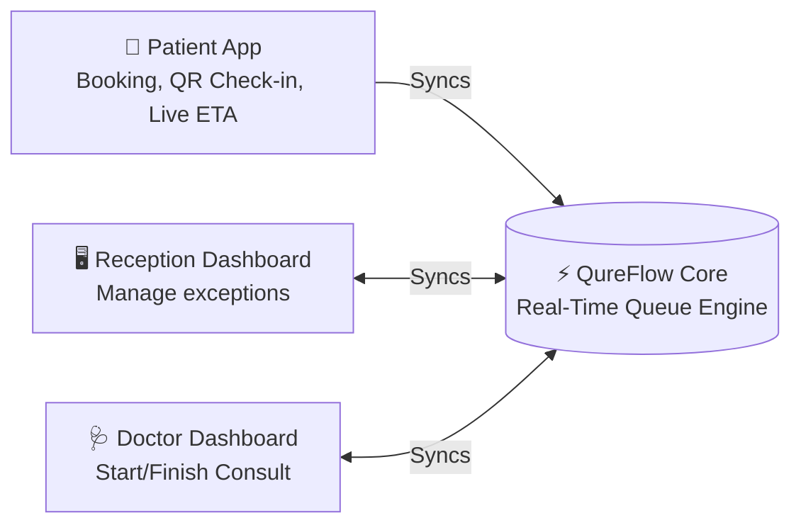

# Problems in Traditional Healthcare Queues

Small clinics rely on appointment registers and physical waiting rooms, creating uncertainty for patients and operational friction for staff.

## Core Pain Points
1. **Unpredictable Waiting Time:** Booking times don't reflect live delays; patients wait endlessly.
2. **Manual Check-in & Queue:** Receptionists verbally manage lists and estimate positions inaccurately.
3. **No Real-Time Visibility:** Patients are blind to how many are ahead or the current consultation status.
4. **Flow Mismatch:** Scheduled times rarely match physical realities due to late arrivals or long consultations.
5. **Fragmented Info:** Doctors lack instant context on the patient's basic vitals when they walk in.

---

# The QureFlow Vision

**QureFlow** is a lightweight, real-time clinic queue management platform connecting patients, reception, and doctors through a single live queue.

* **Patients** book online, self-check-in via QR, and track their live queue position and ETA.
* **Receptionists** monitor arrivals, manage walk-ins, and handle exceptions.
* **Doctors** control the consultation flow and see relevant patient context instantly.

